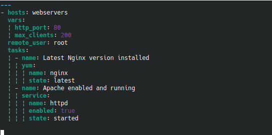

# vim-indentline

### Requirements
* Git
* yamllint

### Deployment
```
sudo {yum|apt|dnf|zypper} yamllint -y
cd ~/
git clone https://github.com/Yggdroot/indentLine.git ~/.vim/pack/vendor/start/indentLine
mv vim-indentline/yamllint/ ~/.config/
```

### Results

```
vim {nginx|others}.yml 
```


